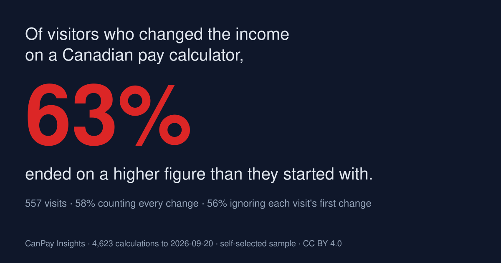
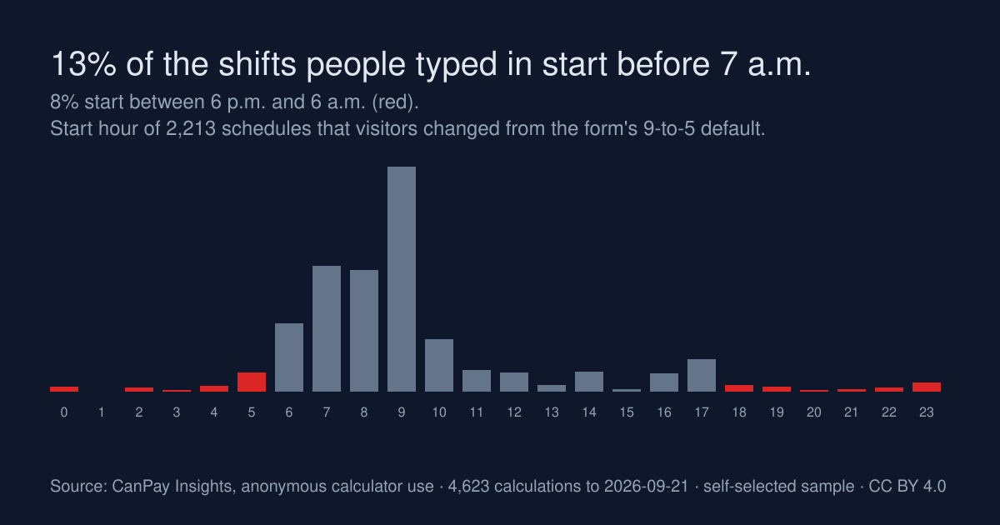
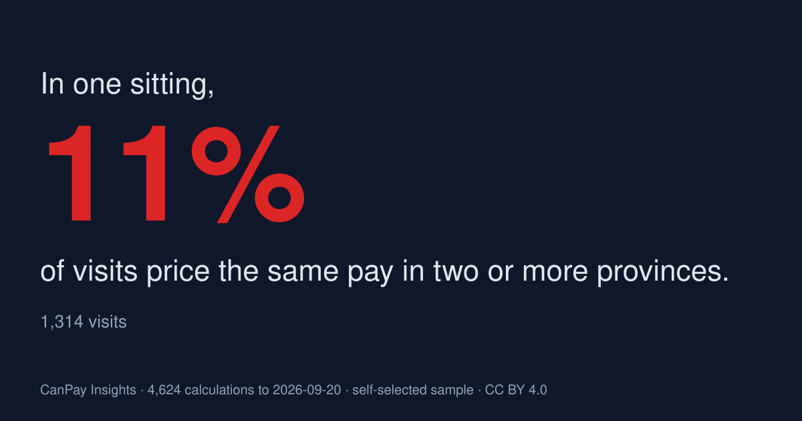

# 60% of Canadians who re-run a pay calculator are pricing a raise, not a pay cut

*Generated 2026-09-10 from 3,155 anonymous calculations. Every figure below is a share of this sample; none is a claim about the Canadian population. Free to cite or republish with a link (CC BY 4.0).*

## What this is, and what it is not

CanPay Insights is a free take-home-pay calculator. Nobody's exact income is stored — only which of seven brackets it falls in — and no IP address, account or device fingerprint is kept. What the calculator can see, and Statistics Canada cannot, is **behaviour**: how people use a pay number once they have it.

The sample is self-selected. People who go looking for a pay calculator skew lower-income than the country ({see the methodology note}), so nothing here should be read as "Canadians earn X". Read it as "this is what people do with a pay figure".

## 1. Pricing the raise

76% of visits calculate more than once. Of those, 70% change the income between runs — and when they do, **60% move it up**. People are not modelling a pay cut they fear; they are pricing the raise or the offer they hope for.

## 2. Night-shift Canada

Of 2,267 shift calculations, **50% start somewhere other than 9 a.m.**, and 6% start between 6 p.m. and 6 a.m. There is no public dataset of when Canadian shifts actually begin; this is the closest thing to one.

## 3. Weighing a move

**11% of visits compare the same pay in two or more provinces in one sitting.** Interprovincial migration shows up in official statistics a year after the move; this is what it looks like while someone is still deciding.

## Methodology

- Source: anonymous, aggregate events from canpayinsights.ca and the CanPay Insights iPhone app, 3,155 calculations to 2026-09-10. Owner and test traffic excluded.
- Income is recorded as one of seven brackets, never an amount. Location is a city centroid from the edge network, never an IP address.
- Self-selection: 64% of calculations sit below the Statistics Canada median wage for the chosen province. This sample is not Canada; the behaviour patterns are what is reported.
- Full definitions and live figures: https://canpayinsights.ca/data · Contact: info@canpayinsights.ca
